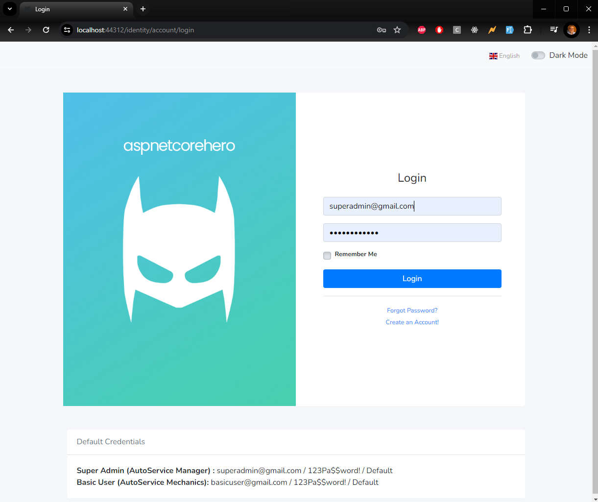
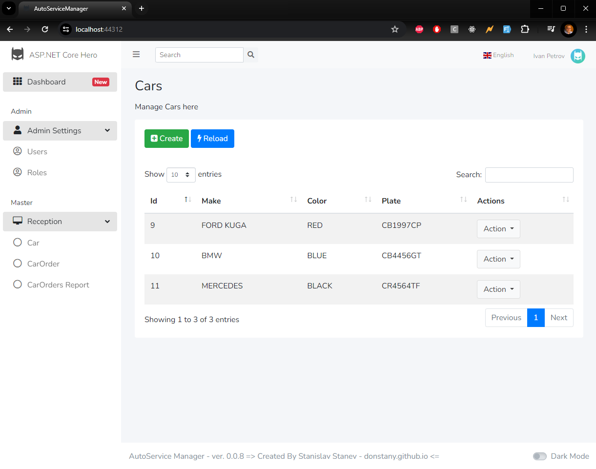
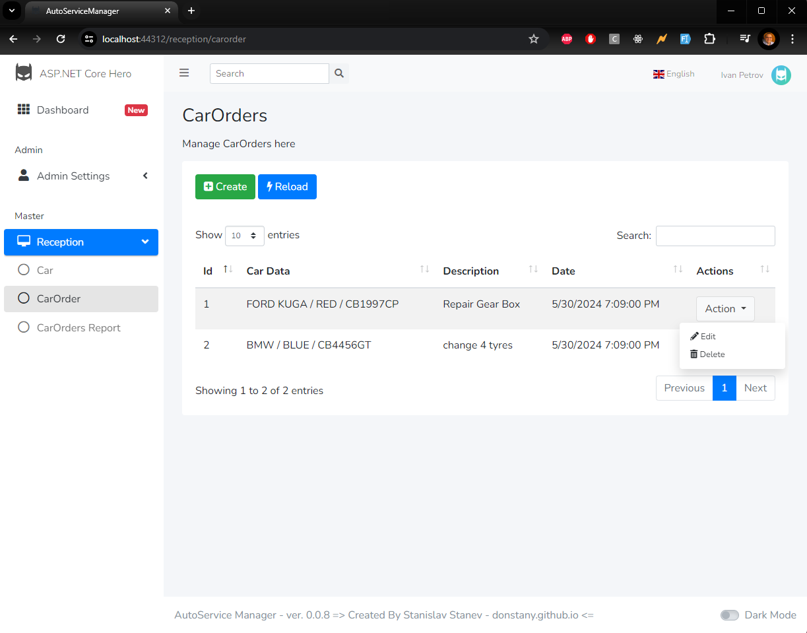
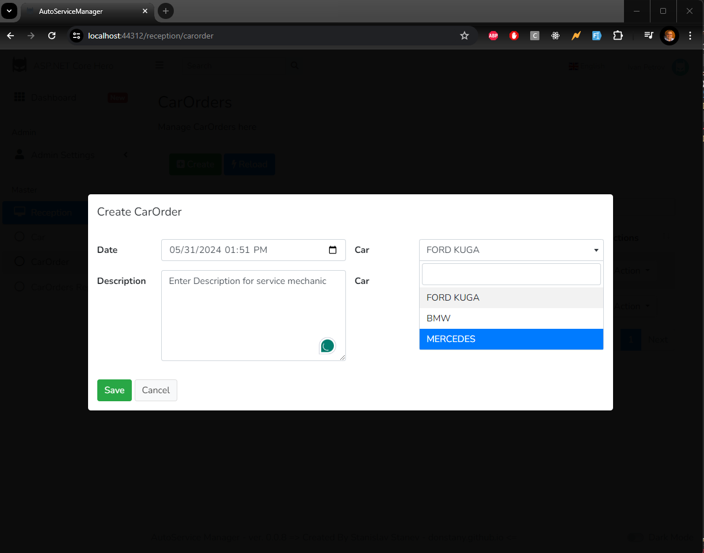
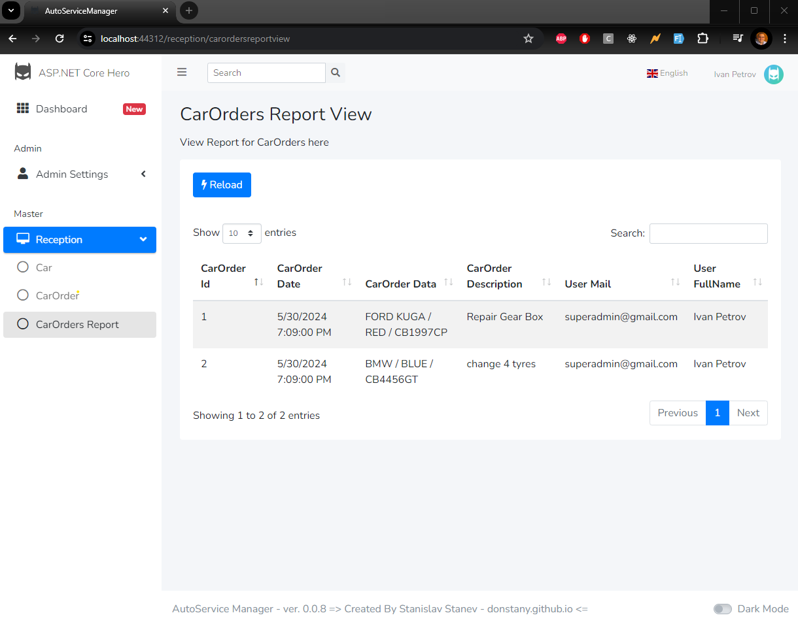
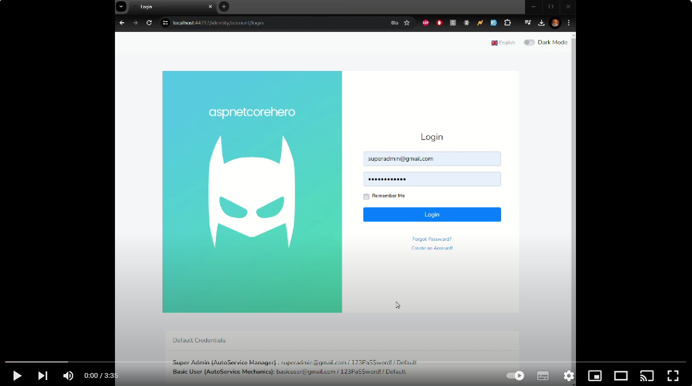

# INTERVIEW TASK

## Develop management system for managing reception in Auto Service

------------------------------------------------------------------------------------
[Back End - ASP.NET Web API] ⇔ [Middleware - jQuery] ⇔ [Front End - jQuery + HTML]
------------------------------------------------------------------------------------
## Bussines Requirment Specification

## I. Objects
	
### 1. Users
- Names *
- Email *
- Password *
- Role * (Manager or Mechanic)

### 2. Orders
- Number (automatically generated, non-editable)
- Date and time (automatically generated, editable)
- Car * (select from a list)
- Description of the problem * (5 to 300 characters)

### 3. Cars
- Brand *
- Color *
- Registration number

## II. Pages
	
### 1. Login
- Email and Password

### 2. Users
- Add/Edit/Delete
- Only Managers have access

### 3. Orders
- Add/Edit/Delete
- When adding or editing, allow adding or selecting an existing car with its parameters

### 4. Report
- A single text field to search among parameters of each query and the cars
- Results should contain "Request No", "Date and Time", "Vehicle Data", "User Data (no password)", "Description of the problem"

## Clarifications

### Managers
(Default to have manager with static login)
- Users: Access Allowed
- Orders: Access Allowed, See all report
- Report: Access Allowed

### Mechanics
- Users: Access Denied
- Orders: Access Allowed, Only see their report
- Report: Access Allowed

## Estimation

- Demonstrate implementations, good practices, (architecture/design) patterns and writing coding style

# SOLUTION
## Screenshots for final functionalities







## Video Presentation in YouTube
For a visual walkthrough of functionalities the project, watch this [YouTube Video](https://youtu.be/5iUPaF0My-Q).

[](https://youtu.be/5iUPaF0My-Q)


## Clean Architecture Boilerplate - ASP.NET Core 5.0 (WebApi & MVC)

Built with Domain Driven Design/Onion/Hexagonal Architecture

Clean Architecture Solution Template for ASP.NET Core 5.0. 

Used template from [ASP.NET Boilerplate](https://aspnetboilerplate.com/)

### Technologies Used

- ASP.NET Core 5.0 MVC
- Entity Framework Core 5.0

### Features Included

#### ASP.NET Core 5.0 MVC Project
- Slim Controllers using MediatR Library
- Permissions Management based on Role Claims
- Toast Notification (includes support for AJAX Calls too)
- Serilog
- ASP.NET Core Identity
- AdminLTE Bootstrap Template (Clean & SuperFast UI/UX)
- AJAX for CRUD (Blazing Fast load times)
- jQuery Datatables
- Select2
- Image Optimization
- Includes Sample CRUD Controllers / Views
- Active Route Tag Helper for UI
- Complete Localization Support / Multilingual
- Clean Areas Implementation
- Dark Mode
- Default Users / Roles Seeding at Startup
- Supports Audit Logging / Activity Logging for Entity Framework Core
- Automapper

### Settings for Running Project Locally

1. **Download/Clone code from GitHub**
2. **Navigate in Visual Studio project AutoServiceManager.Web and set as Startup Project**
3. **Ensure connection string points to correct instance:**
  
   Update `appsettings.json` in AutoServiceManager.Web:
    ```json
    "ConnectionStrings": {
        "ApplicationConnection": "Data Source=localhost;Initial Catalog=AutoServiceManager;Integrated Security=True;MultipleActiveResultSets=True",
        "IdentityConnection": "Data Source=localhost;Initial Catalog=AutoServiceManager;Integrated Security=True;MultipleActiveResultSets=True"
    }
    ```
4. **Run 2 scripts in Package Manager Console in Visual Studio:**
    ```powershell
    Update-Database -Context IdentityContext 
    Update-Database -Context ApplicationDbContext
    ```
5. **Rebuild Solution in Visual Studio**
6. **Run with IIS Express from Visual Studio**
